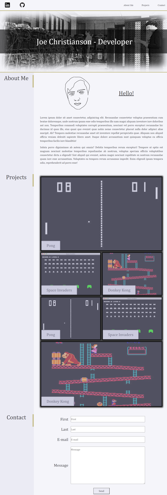

# PersonalPortfolio

## Summary

This app is a personal coding portfolio for Joe Christianson. It has sections for about-me, projects, and a contact form. 

## Details

- Includes developer's name and an avatar
- Navigation Bar has working links to sections below
- The projects section has tiles for each of the projects, with the first project tile being larger.
- The project tiles link to external urls
- The design is reponsive. The document flow changes for different size screens.

## Screenshot

## Live Site

https://joechristianson.github.io/PersonalPortfolio/
